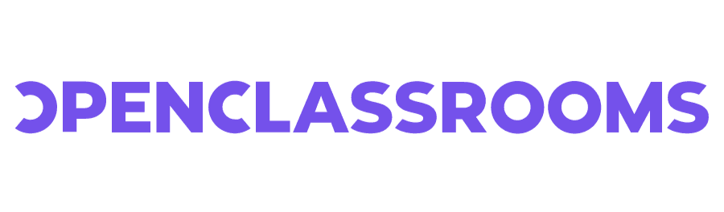

# 🌐 Must-Know Websites for Every Software Engineering Student

In the ever-evolving world of tech, having access to the right learning platforms can give you a serious edge.  
This curated list includes trusted websites that offer high-quality courses, hands-on tutorials, and valuable tools to help you become a better software engineer.

| 🔧 Platform Logo | 📚 Platform Name | 🔗 Visit Website |
|------------------|------------------|------------------|
|  | **OpenClassrooms** | [openclassrooms.com](https://openclassrooms.com) |
|  | **Udemy** | [udemy.com](https://www.udemy.com) |
|  | **Coursera** | [coursera.org](https://www.coursera.org) |
|  | **freeCodeCamp** | [freecodecamp.org](https://www.freecodecamp.org) |
|  | **DataCamp** | [datacamp.com](https://www.datacamp.com) |
|  | **W3Schools** | [w3schools.com](https://www.w3schools.com) |
|  | **SoloLearn** | [sololearn.com](https://www.sololearn.com) |
|  | **WayToLearnX** | [waytolearnx.com](https://www.waytolearnx.com) |
|  | **Cisco Networking Academy** | [netacad.com](https://www.netacad.com) |
|  | **Roadmap.sh** | [roadmap.sh](https://roadmap.sh) |
|  | **Almdrasa.com** | [almdrasa.com](https://almdrasa.com) |
|  | **HP LIFE** | [life-global.org](https://www.life-global.org) |
|  | **Pierre-Giraud.com** | [pierre-giraud.com](https://www.pierre-giraud.com) |
|  | **365 Data Science** | [365datascience.com](https://www.365datascience.com) |
|  | **Codecademy** | [codecademy.com](https://www.codecademy.com) |
|  | **GeeksforGeeks** | [geeksforgeeks.org](https://www.geeksforgeeks.org) |
|  | **TutorialsPoint** | [tutorialspoint.com](https://www.tutorialspoint.com) |
|  | **Udacity** | [udacity.com](https://www.udacity.com) |
|  | **GitHub Student Developer Pack** | [education.github.com/pack](https://education.github.com/pack) |
|  | **TutoWebDesign** | [tutowebdesign.com](https://tutowebdesign.com) |
| Replit logo | **Replit** | [replit.com](https://replit.com) |
| Replit logo | **edX** | [edx.org](https://www.edx.org/) |
|  | **LinkedIn Learning** | [linkedin.com/learning](https://www.linkedin.com/learning) |
